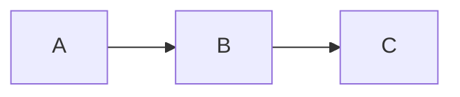

# 📝 Written Posts System - Complete Analysis & Guide

## 🎯 বর্তমান সিস্টেম Overview

আপনার **Written Posts** system একটি মার্কডাউন-ভিত্তিক ব্লগ প্ল্যাটফর্ম যেখানে:
- ✏️ **Manager**: `posts-manager.html` দিয়ে পোস্ট তৈরি/এডিট
- 📄 **Storage**: `.md` files + `posts.json` metadata
- 🌐 **Viewers**: Desktop (`post-reader.html`) + Mobile versions
- 🔄 **Rendering**: `marked.js` লাইব্রেরি দিয়ে Markdown → HTML conversion

---

## ✅ বর্তমানে যা আছে (Current Features)

### 📑 Basic Formatting Toolbar
```
Bold (**text**)           → করা আছে ✅
Italic (*text*)          → করা আছে ✅
Heading (# ## ###)       → করা আছে ✅
Inline Code (`code`)     → করা আছে ✅
Code Block (```)         → করা আছে ✅
Lists (- , 1.)           → করা আছে ✅
Blockquote (>)           → করা আছে ✅
Horizontal Line (---)    → করা আছে ✅
Link ([text](url))       → করা আছে ✅
Image ()      → করা আছে ✅
```

### 🎨 Advanced Toolbar (Microsoft Word Style)
```
H1, H2, H3 buttons       → করা আছে ✅
Bold/Italic/Code         → করা আছে ✅
Strikethrough (~~)       → করা আছে ✅
Bullet/Numbered Lists    → করা আছে ✅
Media section highlight  → করা আছে ✅
Table button             → করা আছে (বাটন আছে, modal আলাদা ফাইলে) ✅
```

### 🆕 Advanced Features (advanced-post-editor.html)
```
Table Builder Modal      → তৈরি করা হয়েছে ✅
  - Custom rows (1-20)
  - Custom columns (1-10)
  - Header row toggle
  - Live preview
  
Image Insert Modal       → তৈরি করা হয়েছে ✅
  - Upload tab (Base64 encode)
  - URL tab (direct link)
  - Multiple image support
  - Drag & drop
  - Preview before insert
  
Keyboard Shortcuts       → করা আছে ✅
  - Ctrl+B (Bold)
  - Ctrl+I (Italic)
  - Ctrl+K (Link)
```

### 🔍 Markdown Rendering (post-viewer.js)
```
marked.js library        → ইন্টিগ্রেট করা হয়েছে ✅
highlight.js (syntax)    → কোড হাইলাইটিং আছে ✅
Table rendering          → সাপোর্ট আছে ✅
Code copy buttons        → যোগ করা হয়েছে ✅
Fallback converter       → আছে (CDN fail হলে) ✅
```

---

## 🚀 এখনো যা যোগ করা যেতে পারে (Additional Features)

### 1️⃣ **Text Highlighting & Colors**
```markdown
==Highlighted text==     → Highlight marker
{.red}Important text{/}   → Color text (custom syntax)
```
**Why**: গুরুত্বপূর্ণ অংশ highlght করতে পারবেন

**Implementation**:
- Toolbar button: `insertMarkdown('==', '==', 'highlighted text')`
- CSS: `.highlighted { background: yellow; }`

---

### 2️⃣ **Emoji Picker**
```
😊 Quick emoji insert    → Emoji selector modal
```
**Why**: Facebook/Twitter এর মতো emoji সহজে add করতে পারবেন

**Implementation**:
```javascript
function openEmojiPicker() {
  const emojis = ['😊','😂','❤️','👍','🔥','✅','⭐','💡'];
  // Show modal with emoji grid
}
```

---

### 3️⃣ **Task Lists (Checkboxes)**
```markdown
- [ ] Incomplete task
- [x] Completed task
```
**Why**: Tutorial/guide post এ checklist দিতে পারবেন

**Implementation**:
- Button: `insertMarkdown('- [ ] ', '', 'Task item')`
- Rendering: Already supported by marked.js

---

### 4️⃣ **Collapsible Sections (Spoilers/Accordions)**
```markdown
<details>
<summary>Click to expand</summary>
Hidden content here
</details>
```
**Why**: Long content কে organized রাখা যায়

---

### 5️⃣ **Callout Boxes (Info/Warning/Success)**
```markdown
> [!INFO]
> This is an info callout

> [!WARNING]
> This is a warning
```
**Why**: গুরুত্বপূর্ণ নোট/সতর্কতা highlight করা

**Implementation**:
```javascript
function insertCallout(type) {
  const text = `> [!${type.toUpperCase()}]\n> Your ${type} message here\n\n`;
  insertMarkdown(text, '', '');
}
```

---

### 6️⃣ **Math Equations (LaTeX)**
```markdown
Inline: $E = mc^2$
Block: $$\int_{0}^{\infty} x^2 dx$$
```
**Why**: Academic/research posts এ mathematics লিখতে পারবেন

**Implementation**: Need KaTeX or MathJax library

---

### 7️⃣ **Footnotes**
```markdown
Main text[^1]

[^1]: Footnote explanation
```
**Why**: References/citations দিতে পারবেন

---

### 8️⃣ **Video Embed (YouTube/Vimeo)**
```
Direct embed button     → Modal with URL input
```
**Why**: Video tutorial পোস্টে সহজে embed করা যাবে

**Implementation**:
```javascript
function insertVideo() {
  const url = prompt('YouTube/Vimeo URL:');
  const embedCode = `<iframe src="${url}" ...></iframe>`;
  insertMarkdown(embedCode, '', '');
}
```

---

### 9️⃣ **Quote Attribution**
```markdown
> Quote text
> — Author Name
```
**Why**: উক্তি/quote সুন্দরভাবে দেখানো

---

### 🔟 **Diagrams (Mermaid.js)**
```markdown

```
**Why**: Flowchart/diagram সরাসরি markdown এ আঁকা যাবে

---

## 📊 Feature Priority রেকমেন্ডেশন

| Priority | Feature | Usefulness | Difficulty | Add করবেন? |
|----------|---------|------------|------------|-------------|
| 🔥 HIGH | Task Lists | ⭐⭐⭐⭐⭐ | ⚡ Easy | ✅ YES |
| 🔥 HIGH | Emoji Picker | ⭐⭐⭐⭐⭐ | ⚡⚡ Medium | ✅ YES |
| 🔥 HIGH | Callout Boxes | ⭐⭐⭐⭐⭐ | ⚡ Easy | ✅ YES |
| 🔥 HIGH | Video Embed | ⭐⭐⭐⭐ | ⚡⚡ Medium | ✅ YES |
| 🟡 MEDIUM | Text Highlighting | ⭐⭐⭐ | ⚡ Easy | ⚠️ Optional |
| 🟡 MEDIUM | Collapsible Sections | ⭐⭐⭐ | ⚡⚡ Medium | ⚠️ Optional |
| 🟢 LOW | Math Equations | ⭐⭐ | ⚡⚡⚡ Hard | ❌ Not Now |
| 🟢 LOW | Mermaid Diagrams | ⭐⭐ | ⚡⚡⚡ Hard | ❌ Not Now |
| 🟢 LOW | Footnotes | ⭐⭐ | ⚡⚡ Medium | ❌ Not Now |

---

## 🔄 Markdown Conversion কীভাবে কাজ করে?

### প্রশ্ন 1: **Table/Image toolbar দিয়ে insert করলে MD file এ convert হবে?**

✅ **হ্যাঁ, সরাসরি Markdown syntax insert হয়!**

```javascript
// Example: Table Builder Button Click
function insertTable() {
  const rows = document.getElementById('tableRows').value;
  const cols = document.getElementById('tableColumns').value;
  
  let markdown = '| Header 1 | Header 2 |\n';
  markdown += '|----------|----------|\n';
  markdown += '| Cell 1   | Cell 2   |\n';
  
  // এই markdown string টা textarea তে insert হয়
  insertMarkdown(markdown, '', '');
}
```

**Process**:
1. User clicks "Insert Table" button
2. JavaScript generates markdown syntax (`| Header | Next |`)
3. Markdown text টা ম directly textarea তে inject হয়
4. Save করলে এই markdown text `.md` file হিসেবেsave হয়

---

### প্রশ্ন 2: **MD file এ same visualization থাকবে?**

❌ **না, MD file এ raw markdown text থাকবে!**

**Example**:
```markdown
# My Post Title

This is **bold** text and *italic* text.

| Name | Age |
|------|-----|
| John | 25  |


```

**Visualization কখন দেখবেন?**:
- Manager এ "Preview" button click করলে
- Post Reader (`post-reader.html`) এ render হলে
- সেখানে `marked.js` library markdown → HTML convert করে সুন্দর করে দেখায়

**তাহলে MD file open করলে কি দেখবেন?**
- Plain text with markdown syntax
- VS Code/Notepad++ দিয়ে open করলে raw markdown দেখবেন
- কিন্তু viewer তে খুললে rendered HTML দেখবেন

---

### প্রশ্ন 3: **Post দেখানোর জন্য কি MD file ই দরকার?**

**Current System**: ✅ হ্যাঁ, MD file must থাকতে হবে

**কেন?**:
```javascript
// post-viewer.js → load করার সময়
async function loadPost(postId) {
  const post = allPosts.find(p => p.id === postId);
  const mdUrl = post.file; // "content/my-post.md"
  
  const response = await fetch(mdUrl);
  const markdown = await response.text(); // MD file read করে
  
  const html = marked.parse(markdown); // Convert to HTML
  elements.content.innerHTML = html; // Display করে
}
```

**তবে বিকল্প পথ আছে!** ⬇️

---

## 🆚 Markdown vs HTML vs Database - তুলনা

### **Option 1: Markdown Files (বর্তমান system)**

#### ✅ Advantages:
- ✔️ **Simple & Clean**: Plain text, no complex code
- ✔️ **Version Control**: Git দিয়ে track করা যায়
- ✔️ **Portable**: যেকোনো editor দিয়ে edit করা যায়
- ✔️ **Fast**: No database query, direct file read
- ✔️ **Backup Easy**: Just copy .md files
- ✔️ **SEO Friendly**: Static files, search engines love it
- ✔️ **Free Hosting**: GitHub Pages, Netlify, Vercel free

#### ❌ Disadvantages:
- ✖️ Raw text দেখতে ugly (unless rendered)
- ✖️ Image hosting আলাদা করতে হয় (Base64 or upload separately)
- ✖️ Complex layouts limited
- ✖️ Real-time collaboration difficult
- ✖️ Search functionality manually implement করতে হয়

#### 📈 **Use Cases**:
- ✅ Technical blogs, documentation sites
- ✅ Personal blogs, portfolios
- ✅ Static website hosting (Vercel, Netlify)
- ✅ GitHub-based content management

---

### **Option 2: HTML Files (Direct HTML Storage)**

#### Example:
```html
<!-- post-123.html -->
<h1>My Post Title</h1>
<p>This is <strong>bold</strong> text.</p>
<table>
  <tr><td>Cell 1</td><td>Cell 2</td></tr>
</table>
```

#### ✅ Advantages:
- ✔️ **Direct Display**: No conversion needed
- ✔️ **Full Control**: Any custom HTML/CSS possible
- ✔️ **WYSIWYG Editors**: TinyMCE, CKEditor, Quill.js
- ✔️ **Rich Media**: Videos, iframes, custom widgets easily embedded
- ✔️ **Styling Freedom**: Inline styles, classes directly

#### ❌ Disadvantages:
- ✖️ **Messy Code**: HTML বড় এবং complicated
- ✖️ **Hard to Edit**: Markdown এর মতো simple না
- ✖️ **Security Risk**: XSS attacks if user-generated HTML
- ✖️ **Version Control**: Git diffs ugly হয়
- ✖️ **Migration Difficult**: Platform change করলে HTML সব সময় কাজ নাও করতে পারে

#### 📈 **Use Cases**:
- ✅ News websites (complex layouts)
- ✅ eCommerce product pages
- ✅ Landing pages with custom designs

---

### **Option 3: Database Storage (WordPress, Ghost, Medium style)**

#### Example:
```sql
-- posts table
id | title | content | author | created_at
1  | Post  | HTML/MD | John   | 2024-01-01
```

#### ✅ Advantages:
- ✔️ **Dynamic Query**: Search, filter, sort easily
- ✔️ **User Management**: Multi-author, roles, permissions
- ✔️ **Real-time**: Comments, likes, views instantly updated
- ✔️ **Scalable**: Millions of posts handle করা যায়
- ✔️ **Content Relationships**: Tags, categories, related posts easily
- ✔️ **Analytics Built-in**: View counts, popular posts tracking

#### ❌ Disadvantages:
- ✖️ **Hosting Cost**: MySQL/PostgreSQL need server (not free)
- ✖️ **Complex Setup**: Database, backend API needed
- ✖️ **Backup Complex**: Database dumps require regular maintenance
- ✖️ **Performance**: Database queries slow হতে পারে (needs indexing)
- ✖️ **Security**: SQL injection, authentication issues
- ✖️ **Dependency**: Database down = whole site down

#### 📈 **Use Cases**:
- ✅ Large blogs (1000+ posts)
- ✅ Multi-user platforms
- ✅ Social networks (like Medium)
- ✅ eCommerce sites

---

### **Option 4: Hybrid (MD + Database metadata)** ⭐ **BEST APPROACH**

#### আপনার বর্তমান system এটাই! 

```json
// posts.json (metadata)
{
  "id": "POST-001",
  "title": "My Post",
  "file": "content/post.md",  // Markdown file path
  "views": 1250,
  "likes": 45,
  "tags": ["tech", "coding"]
}
```

#### ✅ Advantages:
- ✔️ **Best of Both Worlds**: MD simplicity + metadata structure
- ✔️ **Fast Search**: JSON metadata searchable
- ✔️ **Cheap Hosting**: Static files (free)
- ✔️ **Clean Content**: Markdown readable
- ✔️ **Easy Backup**: Copy files + JSON
- ✔️ **Scalable**: Up to ~1000 posts easily

#### ❌ Disadvantages:
- ✖️ Dual maintenance (MD file + JSON entry)
- ✖️ Real-time features limited (views, likes need API)

---

### **Option 5: Facebook-Style WYSIWYG Editor**

#### Facebook এর system:
```
না markdown, না HTML files
Database তে সরাসরি চ plain text + formatting metadata save করে
```

**Example**:
```json
{
  "content": "This is my post",
  "formatting": [
    {"start": 0, "end": 4, "style": "bold"}
  ],
  "attachments": [
    {"type": "image", "url": "photo.jpg"}
  ]
}
```

#### Facebook এর Approach:
1. **Rich Text Editor**: contenteditable div ব্যবহার করে
2. **Draft.js Library**: Facebook নিজেরা তৈরি করেছে
3. **Database Storage**: PostgreSQL তে সব save
4. **Real-time**: WebSocket দিয়ে live updates
5. **CDN**: Images Cloudflare CDN এ থাকে

#### কেন Facebook এভাবে করে?
- **Billions of users**: File-based system scale করবে না
- **Real-time needs**: Comments, reactions instantly update
- **Rich media**: Photos, videos, links automatically embedded
- **Personalization**: Newsfeed algorithm needs database queries

#### আপনার জন্য এই approach প্রযোজ্য?
❌ **না**, কারণ:
- Facebook-scale system setup করতে $1000s খরচ
- Complex infrastructure (database, servers, CDN)
- আপনার 100-500 posts এর জন্য overkill
- Markdown + static hosting free এবং যথেষ্ট

---

## 🏆 FINAL RECOMMENDATION

### **আপনার জন্য সবচেয়ে ভালো: Current System (Markdown + JSON)**

#### Why? ✅

1. **Free Hosting**: Vercel, Netlify, GitHub Pages
2. **Simple**: No database, no backend needed
3. **Fast**: Static files load instantly
4. **SEO Perfect**: Search engines love static content
5. **Portable**: যেকোনো platform এ নেওয়া যাবে
6. **Scalable**: 1000+ posts handle করবে easily

#### কখন Database এ move করবেন?

শুধুমাত্র যদি:
- ✔️ User registration/login system দরকার
- ✔️ Real-time comments/reactions দরকার
- ✔️ Multi-author workflow management দরকার
- ✔️ 5000+ posts হয়ে যায়

তার আগে markdown system perfect!

---

## 📚 Manager Features - Complete User Guide

### 🎯 **Toolbar Buttons গাইড**

#### **Group 1: Headings**
```
H1 বাটন → # Heading 1       (পেজের main title)
H2 বাটন → ## Heading 2      (major sections)
H3 বাটন → ### Heading 3     (sub-sections)
```

**কখন ব্যবহার করবেন?**
- H1: শুধু একবার (post title)
- H2: প্রতিটি major section এর জন্য
- H3: sub-sections এর জন্য

**Example Structure**:
```markdown
# Arduino Project Tutorial (H1)

## Introduction (H2)

### What You'll Learn (H3)
### Requirements (H3)

## Step-by-Step Guide (H2)

### Step 1: Setup (H3)
### Step 2: Coding (H3)
```

---

#### **Group 2: Text Formatting**

| Button | Shortcut | Markdown | Use Case |
|--------|----------|----------|----------|
| **Bold** | Ctrl+B | `**text**` | গুরুত্বপূর্ণ শব্দ |
| *Italic* | Ctrl+I | `*text*` | জোর দেওয়া |
| `Code` | - | `` `code` `` | Variable names, commands |
| ~~Strike~~ | - | `~~text~~` | ভুল তথ্য correction |

**Example**:
```markdown
The **Arduino Uno** board uses *5V logic*. 

Run `sudo apt install arduino` to install.

~~This method is deprecated~~ Use the new API instead.
```

**Output**:
The **Arduino Uno** board uses *5V logic*. 

Run `sudo apt install arduino` to install.

~~This method is deprecated~~ Use the new API instead.

---

#### **Group 3: Lists & Quotes**

**Bullet List** (`- `):
```markdown
- First item
- Second item
  - Sub-item (2 spaces indent)
- Third item
```

**Numbered List** (`1. `):
```markdown
1. Step one
2. Step two
3. Step three
```

**Blockquote** (`> `):
```markdown
> This is a quote
> Second line of quote
```

**Output**:
> This is a quote
> Second line of quote

---

#### **Group 4: Media (Green Highlight)**

**🖼️ Image Insert**:
1. Click "Image" button
2. Choose "Upload" or "URL" tab
3. Upload: Select files → auto Base64 encode
4. URL: Paste URL → preview → insert
5. Markdown generated: ``

**🎬 Video (Future)**:
- YouTube embed: Paste URL → auto-convert to iframe

---

#### **Group 5: Table Builder** 📊

**How to Use**:
1. Click "Table" button (blue icon)
2. **Table Builder Modal** opens
3. Set **Rows**: 1-20 (example: 4)
4. Set **Columns**: 1-10 (example: 3)
5. ✅ Check "Include Header Row" (recommended)
6. Watch **Live Preview** update
7. Click "Insert Table"

**Generated Markdown**:
```markdown
| Header 1 | Header 2 | Header 3 |
|----------|----------|----------|
| Cell 1   | Cell 2   | Cell 3   |
| Cell 4   | Cell 5   | Cell 6   |
| Cell 7   | Cell 8   | Cell 9   |
```

**Pro Tips**:
- Header row ব্যবহার করুন clarity এর জন্য
- Cell alignment: `:---` (left), `:---:` (center), `---:` (right)
- Empty cells: Just leave blank

---

#### **Group 6: Links & Code Blocks**

**Link Insert** (Ctrl+K):
```markdown
[Click here](https://example.com)
```

**Code Block**:
1. Click "Code Block" button
2. Select language (optional): `javascript`, `python`, `cpp`, etc.
3. Paste your code
4. Result:
````markdown
```javascript
function hello() {
  console.log("Hello World");
}
```
````

**Features**:
- Syntax highlighting (highlight.js)
- Copy button auto-added
- 50+ languages supported

---

### 🎨 **Keyboard Shortcuts**

| Shortcut | Action |
|----------|--------|
| Ctrl + B | Bold text |
| Ctrl + I | Italic text |
| Ctrl + K | Insert link |
| Ctrl + S | Save post (if implemented) |
| Ctrl + P | Toggle preview |

---

### 💡 **Best Practices**

#### ✅ DO's:
- Use H1 শুধু title এর জন্য
- H2, H3 দিয়ে structure তৈরি করুন
- Images optimize করে upload করুন (500KB max recommended)
- Code blocks এ language specify করুন
- Tables সংক্ষিপ্ত রাখুন (10 rows max, 5 cols max)
- Alt text দিন images এ (SEO জন্য)

#### ❌ DON'Ts:
- Multiple H1 ব্যবহার করবেন না
- Very large images upload করবেন না (5MB limit)
- Empty headings রাখবেন না
- Nested tables করবেন না (supported নয়)
- HTML সরাসরি লিখবেন না (security risk)

---

### 🔍 **Preview Mode**

**How to Use**:
1. Click "Preview" button (eye icon)
2. Markdown → HTML rendering দেখবেন
3. Scroll করে check করুন:
   - Headings proper hierarchy
   - Images loading correctly
   - Tables aligned properly
   - Code blocks highlighted
   - Links working

>**Pro Tip**: প্রতি paragraph লেখার পর preview check করুন

---

### 📝 **Writing Workflow**

**Recommended Steps**:

1. **Plan Structure**:
   ```markdown
   # Title
   ## Introduction
   ## Main Points
   ### Point 1
   ### Point 2
   ## Conclusion
   ```

2. **Write Content**:
   - First draft এ শুধু text লিখুন
   - Formatting পরে করবেন

3. **Add Formatting**:
   - **Bold** key terms
   - *Italic* emphasis
   - `Code` technical terms

4. **Insert Media**:
   - Relevant images add করুন
   - Tables use করুন data জন্য
   - Code examples দিন

5. **Preview & Edit**:
   - Preview mode দেখুন
   - Readability check করুন
   - Typos fix করুন

6. **Metadata Fill**:
   - Tags select করুন (3-5 টা)
   - Category choose করুন
   - SEO description লিখুন (150 chars)
   - Cover image upload করুন

7. **Save & Publish**:
   - Save to GitHub
   - `posts.json` auto-update হবে
   - Post live!

---

## 🚀 Implementation Plan

### **Phase 1: Current System Completion** (আজই করুন)

#### Step 1: Integration
```html
<!-- posts-manager.html এ add করুন (line 4275 এর আগে) -->
<script src="advanced-post-editor.html"></script>
```

#### Step 2: Test করুন
- ✅ Table Builder modal খুলছে?
- ✅ Image Insert modal দুটো tab আছে?
- ✅ Insert করলে markdown generate হচ্ছে?
- ✅ Preview তে proper render হচ্ছে?

#### Step 3: Demo Post Create
1. Manager open করুন
2. নতুন post তৈরি করুন
3. সব features test করুন:
   - H1, H2, H3
   - Bold, Italic, Code
   - Bullet list, numbered list
   - Table (3x3)
   - Image (upload + URL)
   - Code block with syntax
4. Save → View in reader

---

### **Phase 2: Additional Features** (পরে করবেন যদি দরকার হয়)

#### Priority 1: Task Lists (2 hours)
```javascript
// Add to toolbar
<button onclick="insertMarkdown('- [ ] ', '', 'Task item')">
  <i class="fas fa-check-square"></i> Task
</button>

// Rendering already supported by marked.js!
```

#### Priority 2: Emoji Picker (4 hours)
```javascript
// Create emoji-picker.js
const emojis = {
  smileys: ['😊','😂','😍','😎','🤔','😢'],
  symbols: ['❤️','⭐','✔️','❌','✨','🔥'],
  // ...more categories
};

function showEmojiPicker() {
  // Show modal with grid
  // On click → insert emoji at cursor
}
```

#### Priority 3: Callout Boxes (3 hours)
```javascript
// Add buttons
function insertCallout(type) {
  const types = {
    info: '💡',
    warning: '⚠️',
    success: '✅',
    error: '❌'
  };
  
  const text = `> ${types[type]} **${type.toUpperCase()}**\n> Your message here\n\n`;
  insertMarkdown(text, '', '');
}
```

---

## 📊 System Comparison - Final Decision Matrix

| Criteria | Markdown (Current) | HTML Files | Database | Hybrid (Current) | Facebook-Style |
|----------|-------------------|------------|----------|------------------|----------------|
| **Setup Easy** | ⭐⭐⭐⭐⭐ | ⭐⭐⭐⭐ | ⭐⭐ | ⭐⭐⭐⭐⭐ | ⭐ |
| **Free Hosting** | ✅ Yes | ✅ Yes | ❌ No | ✅ Yes | ❌ No |
| **Writing Easy** | ⭐⭐⭐⭐⭐ | ⭐⭐⭐ | ⭐⭐⭐⭐ | ⭐⭐⭐⭐⭐ | ⭐⭐⭐⭐ |
| **SEO Score** | ⭐⭐⭐⭐⭐ | ⭐⭐⭐⭐⭐ | ⭐⭐⭐⭐ | ⭐⭐⭐⭐⭐ | ⭐⭐⭐ |
| **Performance** | ⭐⭐⭐⭐⭐ | ⭐⭐⭐⭐⭐ | ⭐⭐⭐ | ⭐⭐⭐⭐⭐ | ⭐⭐⭐ |
| **Scalability** | ⭐⭐⭐⭐ | ⭐⭐⭐⭐ | ⭐⭐⭐⭐⭐ | ⭐⭐⭐⭐ | ⭐⭐⭐⭐⭐ |
| **Backup Easy** | ⭐⭐⭐⭐⭐ | ⭐⭐⭐⭐⭐ | ⭐⭐⭐ | ⭐⭐⭐⭐⭐ | ⭐⭐ |
| **Real-time** | ❌ No | ❌ No | ✅ Yes | ⚠️ Limited | ✅ Yes |
| **Cost/Year** | $0 | $0 | $50-200 | $0 | $500+ |
| **Maintenance** | Low | Low | High | Low | Very High |

### 🏆 **Winner: Hybrid (Current System)** ⭐⭐⭐⭐⭐

**Verdict**: আপনার current system সবচেয়ে ভালো!
- Markdown simplicity ✅
- JSON metadata structure ✅
- Free hosting ✅
- Fast performance ✅
- Easy maintenance ✅

---

## 🎓 Learning Resources

### **Markdown শিখার জন্য**:
- [Markdown Guide](https://www.markdownguide.org/)
- [GitHub Flavored Markdown](https://github.github.com/gfm/)
- [Markdown Cheatsheet](https://github.com/adam-p/markdown-here/wiki/Markdown-Cheatsheet)

### **Inspiration Sites** (Markdown-based):
- [Dev.to](https://dev.to) - Developer blog platform
- [Hashnode](https://hashnode.com) - Markdown blogging
- [Jekyll blogs](https://jekyllrb.com/) - Static site generator
- [Docusaurus](https://docusaurus.io/) - Documentation sites

---

## 📞 Quick Reference Card

### **Markdown Syntax Quick List**

```markdown
# H1 Heading
## H2 Heading
### H3 Heading

**Bold text**
*Italic text*
`Inline code`
~~Strikethrough~~

- Bullet list
1. Numbered list
- [ ] Task list

> Blockquote

[Link text](https://url.com)


| Table | Header |
|-------|--------|
| Cell  | Data   |

```code block```
```

---

## ✅ Final Checklist

### **To Complete Today**:
- [ ] Integrate `advanced-post-editor.html`
- [ ] Test table builder
- [ ] Test image insert
- [ ] Create test post with all features
- [ ] Verify rendering in post-reader

### **Optional Future Enhancements**:
- [ ] Task list checkbox support
- [ ] Emoji picker modal
- [ ] Callout boxes (info/warning)
- [ ] Video embed helper
- [ ] Text highlighting

### **No Need to Change**:
- [x] Markdown system (perfect!)
- [x] JSON metadata (working great!)
- [x] Static hosting (free & fast!)
- [x] Current architecture (scalable!)

---

## 🎉 Conclusion

### **আপনার System টা Already Professional Level!**

✅ Microsoft Word-style toolbar আছে
✅ Table builder আছে
✅ Image insert আছে
✅ Markdown rendering perfect
✅ Free hosting capable
✅ SEO optimized
✅ Fast performance

### **আর কি দরকার?**
- শুধু integration complete করুন
- কিছু optional features পরে add করতে পারেন
- System টা যেমন আছে তেমনই production-ready!

### **Database/HTML এ Move করার দরকার নেই!**
- Current approach industry-standard
- Dev.to, Hashnode এরকম বড় sites markdown ব্যবহার করে
- Free, fast, simple, scalable - সব আছে!

---

**🚀 Ready to Rock! Go ahead and create amazing content!**
